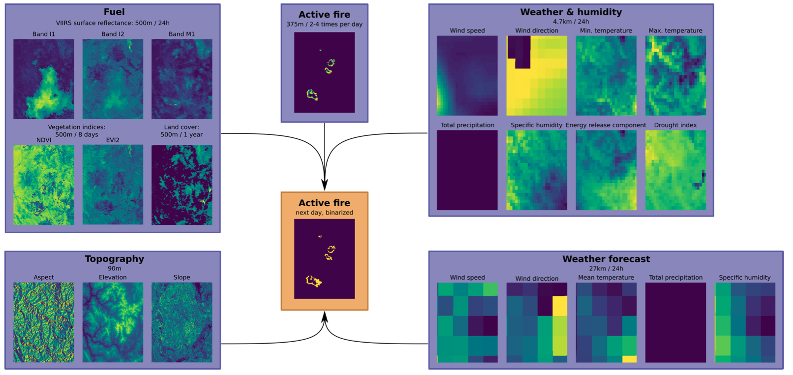

# AI4GOOD Class Fall 2025 : Wildfire spread prediction project


*This repository contains the base code for the wildfire spread prediction task. 
It is based on the WildFireSpreadTS benchmark, and the code is mostly copied from the [original implementation](https://github.com/SebastianGer/WildfireSpreadTS) by the authors (Sebastian Gerard, Yu Zhao, and Josephine Sullivan).*

## 1. Presentation of the problem

**Wildfires** are a natural component of many ecosystems, but human activity and climate change have increased their frequency, intensity, and duration. These events pose a significant threat to human lives, property, and natural environments, causing vast ecological damage and releasing immense amounts of smoke and greenhouse gases. Predicting the path and rate of a wildfire's spread is a critical challenge for emergency management. Accurate spread prediction enables firefighters to allocate resources effectively, plan evacuation routes, and deploy containment strategies to protect communities and vital infrastructure. Traditionally, spread prediction relied on fire behavior models that use ground-based data like weather conditions, fuel type, and topography. However, these methods can be limited by a lack of real-time data from remote or inaccessible areas. In this context, data-driven approaches using remote sensing observations offer the opportunity of more accurate and timely estimation of wildfire spread. 



**The WildFireSpreadTS** benchmark is a machine learning-ready dataset to evaluate next-day spread prediction models. Given a binary map of the active fire locations during day d, and different input modalities, the task is to predict where the fire will be active on day d+1. To make this prediction, models have access to a 5 day history of remote sensing observations and weather conditions, static topographic information, as well as the weather forecast for the next day. 

Read the [paper](https://proceedings.neurips.cc/paper_files/paper/2023/file/ebd545176bdaa9cd5d45954947bd74b7-Paper-Datasets_and_Benchmarks.pdf) to learn more about the dataset.


## 2. Setting up 📦

📠 **Hardware requirements**: 150GB SSD disk space, 32GB RAM, Minimum 10GB GPU VRAM 

👩‍💻 **Software requirements**: A [github](https://github.com/) acount and a [wandb](https://wandb.ai/) acount. 

### 2.1 Code and Python environment  🐍

Fork the code to your own github account and clone it to your machine. 
Create a virtualenv with `python=3.10.4` and install requirements (install mamba or similar virtualenv management framework if needed). 

```bash
wget https://github.com/conda-forge/miniforge/releases/latest/download/Miniforge3-Linux-x86_64.sh
bash Miniforge3-Linux-x86_64.sh

# accept everything, say yes, close terminal onces it finishes and open a new one.

git clone git@github.com:your-account/ai4good25-wildfire.git
cd ai4good25-wildfire

mamba create -n wildfire python=3.10.4
mamba activate wildfire
pip install -r requirements.txt
```

### 2.2 Retrieve and process dataset 💽

1. Download the compressed dataset, run in your shell: 
```bash
wget https://zenodo.org/api/records/8006177/files-archive
```
2. Unzip the contents of the archive (twice)
3. Process data into HDF5 format using the provided script:
```python
python3 src/preprocess/CreateHDF5Dataset.py --data_dir YOUR_DATA_DIR --target_dir YOUR_TARGET_DIR
```

### 2.3 Check that everything is working fine ✅

Test your set up by running the UNET mono-temporal baseline for a few epochs 
(modify the last argument with the path to your processed dataset):

```bash
mamba activate wildfire
python src/train.py --config=cfgs/unet/res18_monotemporal.yaml --trainer=cfgs/trainer_single_gpu.yaml --data=cfgs/data_monotemporal_full_features.yaml --seed_everything=0 --trainer.max_epochs=5 --do_test=True --data.data_dir /path/to/your/hdf5/dataset
```


## 3. Objectives and performance metrics 🎯

Your objective is two-fold: 

1. Achieve the **best possible spread estimation**, as measured by the Average Precision (AP) metric,
2. Ensure good **probability calibration**, as measured by the Unweighted Calibration Error (UCE) 

More details on the 2 objectives :
- The first objective is a simple pixel binary classification objective (Fire/No Fire). To be robust to thresholding, the classification performance is evaluated using the [Average Precision](https://www.baeldung.com/cs/precision-vs-average-precision)(AP) instead of overall accuracy, the test routine in the codebase includes the computation of this metric and it is logged as `test_AP` in the wandb logger. Because computing this metric involves keeping all predictions in memory and ranking them, it is quite memory intensive and is hence only computed at test time. 
*AP has values between 0 and 1 and higher is better.* 
- Beyond a simple binary prediction, it is very valuable for critical applications to also have meaningful predicted probabilities. This gives more detailed information, for example allowing to prioritise firefighting deployment in areas where fire was predicted with high probability over lower probability areas. For this probability to be valuable we need to make sure that it is indeed reflecting the true wildfire probability: pixels predicted with 90% probability should correspond to wildfire 90% of the time. This "probability quality" is measured by the [Expected Calibration Error (ECE)](https://iclr-blogposts.github.io/2025/blog/calibration/). In our case, given the high imbalance of our data we will use the Unweighted Calibration Error (UCE), which is the same as ECE but without weighting the average difference by the number of samples in each bin. 
*UCE has values between 0 and 1 and lower is better.* 

➡️ TL;DR : make a model with AP as high as possible, and UCE as low as possible. 

## 4. Baseline and evaluation protocol 𐄷

The baseline model is a **UTAE model** to which all inputs for the past five days are provided as input (see paper for more details).


| Model   |  AP* ↥ | UCE* ↧ | 
|---|---|---|
| UTAE baseline  | 0.39345  |  0.38172 |  

\* *average across 12 folds*

The WildFireSpreadTS benchmark comes with an official 12-fold split. Use this official split to evaluate your model and report the average AP and UCE test set performance across the 12 splits. Use the `--data.data_fold_id` flag of the `train.py` script to run the corresponding split. There is also a `--unique_tag` flag that you can use to group folds of the same configuration (Use Group runs by "unique_tag" in the wandb web interface). 


To reduce computational load when you are exploring different ideas / hyperparameters, you can just use a subset of those folds (for example folds 2, 6, and 11), and do the full evaluation when you have found a strong configuration. 

The training script will compute the AP and UCE metrics automatically on the test set at the end of training and they will be logged to wandb. If you need to recompute the metrics on stored predictions you can directly use the `compute_metrics_and_plots` function in `src/models/EvaluationMetrics.py`.

Example command to run fold 11 of the baseline model:

```bash 
python src/train.py --data.data_fold_id 11 --config=cfgs/UTAE/all_features.yaml --trainer=cfgs/trainer_single_gpu.yaml --data=cfgs/data_multitemporal_full_features_doys.yaml --seed_everything=0  --do_test=True --data.data_dir /path/to/your/hdf5/dataset 
```


## 5. Tips 🛟

- The present codebase is using Pytorch Lightning which is a wrapper of Pytorch that takes care of all the deep learning code that is common to all projects (e.g., training and evaluation loops). If you are not familiar with it, have a look at the documention to get a high level understanding of how it works, in particular the `LightningModule` and `LightningDataModule` classes.
- It also uses LightningCLI which allows you to instanciate your models, dataset, and trainer classes using yaml configuration files (but you can always also use the cli). The recommended workflow is to use the config files:
  - One to set the model parameters, passed using the `--config` flag (example : `cfgs/UTAE/all_features.yaml`)  
  - One to set the dataset parameters, passed using the `--data` flag (example : `cfgs/data_multitemporal_full_features_doys.yaml`)  
  - One to set the trainer parameters, passed using the `--trainer` flag (example : `ccfgs/trainer_single_gpu.yaml`)  
- Example if you want to code your own architecture and train it:
  - Implement your architecture in pytorch
  - Create a LightningModule class for your architecture that inherits from the `BaseModel` class. 
  - Write a new config file that provides the hyperparameters for your new architecture. 

## Credits 

Benchmark and paper authors: Sebastian Gerard, Yu Zhao, and Josephine Sullivan

Original Code: https://github.com/SebastianGer/WildfireSpreadTS

Paper citation:
```
@inproceedings{
    gerard2023wildfirespreadts,
    title={WildfireSpread{TS}: A dataset of multi-modal time series for wildfire spread prediction},
    author={Sebastian Gerard and Yu Zhao and Josephine Sullivan},
    booktitle={Thirty-seventh Conference on Neural Information Processing Systems Datasets and Benchmarks Track},
    year={2023},
    url={https://openreview.net/forum?id=RgdGkPRQ03}
}
```